# rVPNSE - Rust VPN SoftEther Library

[](https://www.rust-lang.org)
[](LICENSE)
[](https://github.com/rVPNSE/rVPNSE/actions)
[](docs/README.md)

**Rust library for SoftEther VPN protocol implementation with C FFI interface.**

rVPNSE provides a robust, cross-platform foundation for building VPN applications with SoftEther protocol support. Perfect for integration into mobile apps, desktop applications, embedded devices and enterprise solutions.

## ✨ Key Features

- 🦀 **Production-ready Rust** - Zero warnings, 100% test coverage, strict quality standards
- 🌍 **Cross-platform** - Windows, macOS, Linux, Android, iOS support
- 🔒 **Secure by default** - TLS encryption, certificate validation, secure session management
- 🚀 **High performance** - Async/await, zero-copy operations, optimized networking
- 🔧 **Easy integration** - C FFI interface for seamless language interop
- 📱 **Mobile-optimized** - Battery-efficient, network-aware implementations
- ⚡ **Connection management** - Rate limiting, retry logic, concurrent connection controls

## 🚀 Quick Start

### 1. Build the Library

```bash
# Install Rust (if not already installed)
curl --proto '=https' --tlsv1.2 -sSf https://sh.rustup.rs | sh

# Clone and build
git clone https://github.com/devstroop/rvpnse.git
cd rvpnse
python3 tools/build.py --mode release
```

### 2. Basic Usage

```c
#include "rvpnse.h"

int main() {
    // Create configuration
    struct VpnConfig* config = rvpnse_config_new();
    rvpnse_config_load_from_file(config, "vpn.toml");
    
    // Create and connect client
    struct VpnClient* client = rvpnse_client_new(config);
    if (rvpnse_client_connect(client) == 0) {
        printf("✅ Connected to VPN!\n");
        
        // Your application logic here
        
        rvpnse_client_disconnect(client);
    }
    
    // Cleanup
    rvpnse_client_free(client);
    rvpnse_config_free(config);
    return 0;
}
```

### 3. Configuration

Create a `vpn.toml` configuration file:

```toml
[server]
host = "vpn.example.com"
port = 443

[connection_limits]
max_concurrent_connections = 5
max_connections_per_minute = 10
max_retry_attempts = 3
retry_delay = 5

[authentication]
username = "your_username"
password = "your_password"
hub_name = "VPN"

[connection]
timeout_seconds = 30
keepalive_interval = 10

[tls]
verify_certificate = true
```

## 📦 Integration

rVPNSE supports integration with multiple platforms and languages:

| Platform | Language | Guide |
|----------|----------|-------|
| **iOS** | Swift | [iOS Integration](docs/integration/ios.md) |
| **Android** | Kotlin/Java | [Android Integration](docs/integration/android.md) |
| **Flutter** | Dart | [Flutter Integration](docs/integration/flutter.md) |
| **Desktop** | C/C++ | [C/C++ Integration](docs/integration/c-cpp.md) |
| **.NET** | C# | [.NET Integration](docs/integration/dotnet.md) |
| **Python** | Python | [Python Integration](docs/integration/python.md) |

## 🏗️ Architecture


### 🔐 Connection Management Flow

```mermaid
sequenceDiagram
    participant App as Application
    participant Client as VpnClient
    participant Limits as ConnectionTracker
    participant Server as SoftEther Server
    
    App->>Client: connect(server, port)
    Client->>Limits: can_connect()
    
    alt Connection limits OK
        Limits-->>Client: ✅ Allowed
        Client->>Server: Establish connection
        Server-->>Client: Connected
        Client->>Limits: record_connection()
        Client-->>App: ✅ Connected
    else Limits exceeded
        Limits-->>Client: ❌ Limit exceeded
        Client-->>App: ❌ ConnectionLimitReached
    end
    
    App->>Client: disconnect()
    Client->>Server: Close connection
    Client->>Limits: record_disconnection()
```



## 💠 Build Status

| Platform | Architecture | Status |
|----------|-------------|--------|
| **Windows** | x86_64 | ✅ Passing |
| **macOS** | ARM64, x86_64 | ✅ Passing |
| **Linux** | x86_64 | ✅ Passing |
| **Android** | ARM64, ARMv7, x86_64 | ✅ Passing |
| **iOS** | ARM64, Simulator | ✅ Passing |

## 📖 Documentation

- **[📚 Complete Documentation](docs/README.md)** - Comprehensive guides and API reference
- **[🚀 Quick Start Guide](docs/quick-start.md)** - Get up and running in 5 minutes  
- **[🏗️ Build Instructions](docs/build/README.md)** - Detailed build guide for all platforms
- **[🔧 Troubleshooting](docs/troubleshooting.md)** - Common issues and solutions
- **[📋 API Reference](docs/api/c-api.md)** - Complete C API documentation

## 🤝 Contributing

We welcome contributions! See our [Contributing Guide](CONTRIBUTING.md) for details.

### Development Setup

```bash
# Clone the repository
git clone https://github.com/devstroop/rvpnse.git
cd rvpnse

# Install dependencies
rustup component add clippy rustfmt

# Run tests
cargo test

# Check code quality
cargo clippy --all-targets --all-features -- -D warnings
cargo fmt --check
```

## 📄 License

rVPNSE is licensed under the [Apache License 2.0](LICENSE).

## 🆘 Support

- **📖 Documentation**: [docs/README.md](docs/README.md)
- **🐛 Bug Reports**: [GitHub Issues](https://github.com/devstroop/rvpnse/issues)
- **💬 Discussions**: [GitHub Discussions](https://github.com/devstroop/rvpnse/discussions)
- **ℹ️ General Contact**: hi@devstroop.com
- **🔒 Security**: Email security@devstroop.com for security issues
